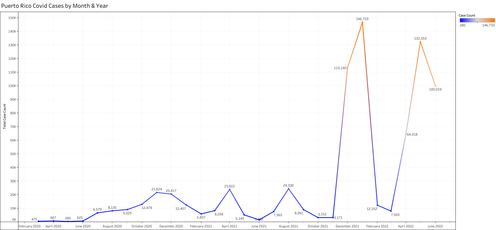

# Case Study: Which Months Have the Highest Infection Cases of Covid-19 Virus in Puerto Rico?
### Summary

&nbsp;&nbsp;&nbsp;&nbsp;&nbsp;&nbsp;This is a personal investigation project that I decided to do when one day I was reading the statistics about Covid-19 and I wondered which were the months with the highest cases of the virus in Puerto Rico. Also, I seek to identify what happened during those months that made the infection rate increase. On the other hand, the months I will be using during this investigation are between the years 2020 and 2022.

---

### Questions
1.	Which month has the highest cases of Covid-19 in Puerto Rico?
2.	What happened during these months that made the Covid-19 cases increase?

---

### Gathering

&nbsp;&nbsp;&nbsp;&nbsp;&nbsp;&nbsp;In the gathering stage, I began to search for the data on the internet. The website that has all the data needed for this project was the Department of Health of Puerto Rico. After finding it, I downloaded the dataset that is in csv format. Then I opened the file to see and analyze the structure of the data before beginning with the transform stage.
  
---

### Transform

&nbsp;&nbsp;&nbsp;&nbsp;&nbsp;&nbsp;In the transformation stage I began by creating a copy of the file, to have a backup in case of problems. Then started hiding some columns that would not be needed. Also, the date column is modified to a better type of date for the analysis stage. In addition, I edited each column data type. After that, I save the file to begin with the analysis stage.

---

### Analysis

&nbsp;&nbsp;&nbsp;&nbsp;&nbsp;&nbsp;In the analysis stage the first thing a did was to export the dataset to MySQL to begin with the analysis. The first query that I did was to get the total case of covid between March 2020 and June 2022. Next, I made a query to get the total case by month. Finally, I exported all the results in a csv format to begin with visualization stage.

---

### Visualization

&nbsp;&nbsp;&nbsp;&nbsp;&nbsp;&nbsp;In the visualization stage I started creating the visuals in Tableau with the existing analysis stage results. 

---

### Conclusion

&nbsp;&nbsp;&nbsp;&nbsp;&nbsp;&nbsp;After doing this personal investigation, I found that there are many months with the highest covid cases in Puerto Rico. The first months with highest cases are between December 2021 and January 2022, which correlate with Christmas time and bad bunny concerts. On the other hand, the other months with highest cases are between April and June of 2022. During these months the government removed all covid-19 virus restrictions. Finally, with this case study I was able to find which were the months with the highest cases of covid-19 in Puerto Rico.
