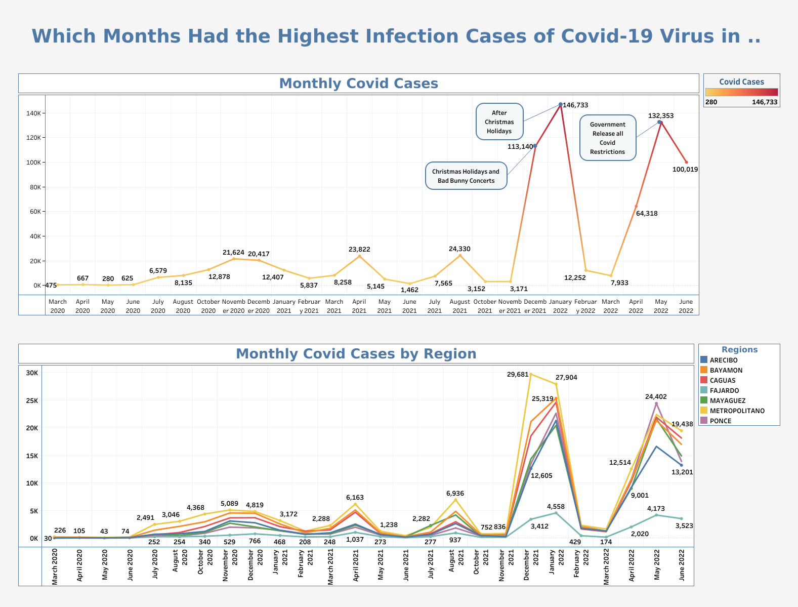

# Case Study: Which months had the highest infection cases of Covid-19 virus in Puerto Rico?

&nbsp;&nbsp;&nbsp;&nbsp;&nbsp;&nbsp;This is a data analysis project where I use a dataset of all Covid-19 virus cases in Puerto Rico between 2020 and 2022. The objective was to find which were the months with the highest cases and what made them the highest ones. The tools used for the project were Excel, SQL, MySQL, and Tableau.

## Objetive
&nbsp;&nbsp;&nbsp;&nbsp;&nbsp;&nbsp; Find which were the months with the highest cases of the covid-19 virus in Puerto Rico and identify what caused those months to have the highest cases of infection.

## Questions
1.	Which months had the highest cases of Covid-19 in Puerto Rico?
2.	What happened during these months that caused Covid-19 cases to increase?
   
## Tools & Technologies
* Dataset - [Department of Health of Puerto Rico](https://www.salud.pr.gov/)
* Database - [MySQL](https://www.mysql.com/)
* MS Office - [Excel](https://www.microsoft.com/en-us/microsoft-365/excel)
* Data Visualization - [Tableau](https://www.tableau.com/)
* Language - [SQL](https://www.mysql.com/)

## Data Analysis Process

1. Collect
   
      * First, I get the dataset from the Department of Health of Puerto Rico that is in csv format. This dataset only have data from the years of 2020 and 2022.
  
2. Clean

    * Before I began cleaning the data in Excel, I create a copy of each file in case something bad happen while cleaning. Then start hiding some columns that would not be needed. Also, the date column is modified to a better type of date for the analysis stage. In addition, I set each column to their data type because they were in text format. After that, I save the file to begin with the analysis stage.

3. Analyze

    * In the analyze step the first thing a did was to export the dataset to MySQL. Then I create queries to get the total case of covid by month between March 2020 and June 2022 in Puerto Rico and also the total case by month per region. Finally, I exported all the results in csv format to Tableau.

4. Visualization

   * In the final step I started creating linear graph for each of the csv files and then created the dashboard that will show both graph together.

## Conclusion

&nbsp;&nbsp;&nbsp;&nbsp;&nbsp;&nbsp;Finally, after finishing with the analysis, I found that there are two group of months with the highest covid cases in Puerto Rico. The first group of months with highest cases are between December 2021 and January 2022, which correlate with Christmas Holidays and bad bunny concerts. On the other hand, the other group of months with highest cases are between April and June of 2022. During these months the government removed all covid-19 virus restrictions. Finally, with this case study I was able to find which were the months with the highest cases of covid-19 in Puerto Rico and what caused those months to have the highest cases of infection.

* The link for the visualization: https://public.tableau.com/app/profile/joseph.marrero/viz/PuertoRicoCovidCases/PR_Month_Cases

